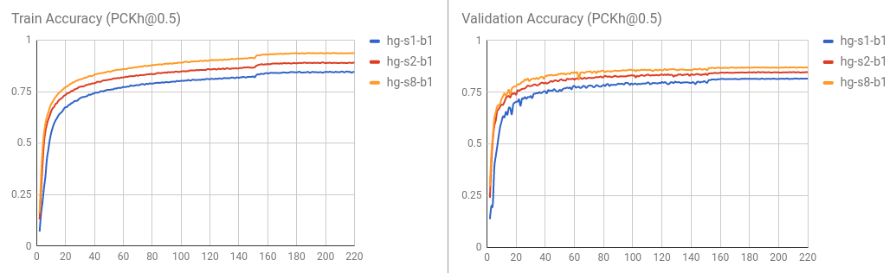

# PyTorch-Pose

PyTorch-Pose is a PyTorch implementation of the general pipeline for 2D single human pose estimation. The aim is to provide the interface of the training/inference/evaluation, and the dataloader with various data augmentation options for the most popular human pose databases (e.g., [the MPII human pose](http://human-pose.mpi-inf.mpg.de), [LSP](http://www.comp.leeds.ac.uk/mat4saj/lsp.html) and [FLIC](http://bensapp.github.io/flic-dataset.html)).

Some codes for data preparation and augmentation are brought from the [Stacked hourglass network](https://github.com/anewell/pose-hg-train). Thanks to the original author.

## Features
- Multi-thread data loading
- Multi-GPU training
- Logger
- Training/testing results visualization

## Installation
1. PyTorch (>= 0.2.0): Please follow the [installation instruction of PyTorch](http://pytorch.org/). Note that the code is developed with Python2 and has not been tested with Python3 yet.

2. Clone the repository with submodule
   ```
   git clone --recursive https://github.com/bearpaw/pytorch-pose.git
   ```

3. Create a symbolic link to the `images` directory of the MPII dataset:
   ```
   ln -s PATH_TO_MPII_IMAGES_DIR data/mpii/images
   ```

4. Modify your `.bashrc` file:
   ```
   export PYTHONPATH=".:$PYTHONPATH"
   ```

## Usage

### Testing
You may download our pretrained models (e.g., [2-stack hourglass model](https://drive.google.com/drive/folders/0B63t5HSgY4SQQ2FBRE5rQ2EzbjQ?usp=sharing)) for a quick start.

Run the following command in terminal to evaluate the model on MPII validation split (The train/val split is from [Tompson et al. CVPR 2015](http://www.cims.nyu.edu/~tompson/data/mpii_valid_pred.zip)).
```
CUDA_VISIBLE_DEVICES=0 python example/mpii.py -a hg --stacks 2 --blocks 1 --checkpoint checkpoint/mpii/hg_s2_b1 --resume checkpoint/mpii/hg_s2_b1/model_best.pth.tar -e -d
```
* `-a` specifies a network architecture
* `--resume` will load the weight from a specific model
* `-e` stands for evaluation only
* `-d` will visualize the network output. It can be also used during training

The result will be saved as a `.mat` file (`preds_valid.mat`), which is a `2958x16x2` matrix, in the folder specified by `--checkpoint`.

#### Evaluate the PCKh@0.5 score

##### Evaluate with MATLAB

You may use the matlab script `evaluation/eval_PCKh.m` to evaluate your predictions. The evaluation code is ported from  [Tompson et al. CVPR 2015](http://www.cims.nyu.edu/~tompson/data/mpii_valid_pred.zip).

The results (PCKh@0.5 score) trained using this code is reported in the following table.


| Model            | Head | Shoulder | Elbow | Wrist | Hip  | Knee  | Ankle | Mean |
| ---------------- | -----| -------- | ----- | ----- | ---- | ------|------ | ---- |
| hg_s2_b1 (last)  | 95.80| 94.57    | 88.12 | 83.31 | 86.24| 80.88 | 77.44 | 86.76|
| hg_s2_b1 (best)  | 95.87| 94.68    | 88.27 | 83.64 | 86.29| 81.20 | 77.70 | 86.95|
| hg_s8_b1 (last)  | 96.79| 95.19    | 90.08 | 85.32 | 87.48| 84.26 | 80.73 | 88.64|
| hg_s8_b1 (best)  | 96.79|	95.28	 | 90.27 | 85.56 | 87.57| 84.3  | 81.06	| 88.78|

Training / validation curve is visualized as follows.


##### Evaluate with Python

You may also evaluate the result by running `python evaluation/eval_PCKh.py` to evaluate the predictions. It will produce exactly the same result as that of the MATLAB. Thanks [@sssruhan1](https://github.com/sssruhan1) for the [contribution](https://github.com/bearpaw/pytorch-pose/pull/2).

### Training
Run the following command in terminal to train an 8-stack of hourglass network on the MPII human pose dataset.
```
CUDA_VISIBLE_DEVICES=0 python example/mpii.py -a hg --stacks 8 --blocks 1 --checkpoint checkpoint/mpii/hg8 -j 4
```
Here,
* `CUDA_VISIBLE_DEVICES=0` identifies the GPU devices you want to use. For example, use `CUDA_VISIBLE_DEVICES=0,1` if you want to use two GPUs with ID `0` and `1`.
* `-j` specifies how many workers you want to use for data loading.
* `--checkpoint` specifies where you want to save the models, the log and the predictions to.

Please refer to the `example/mpii.py` for the supported options/arguments.

## To Do List
Supported dataset
- [x] [MPII human pose](http://human-pose.mpi-inf.mpg.de)
- [x] [Leeds Sports Pose (LSP)](http://sam.johnson.io/research/lsp.html)
- [x] [MSCOCO (single person)](http://cocodataset.org/#keypoints-challenge2017)
- [ ] FLIC

Supported models
- [x] [Stacked Hourglass networks](https://arxiv.org/abs/1603.06937)

## Contribute
Please create a pull request if you want to contribute.
